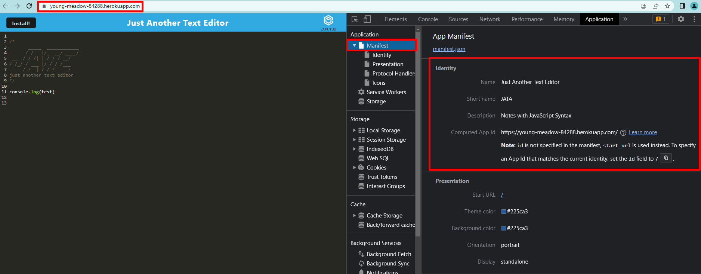
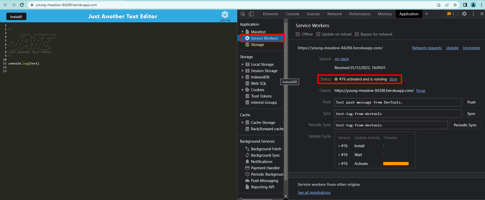
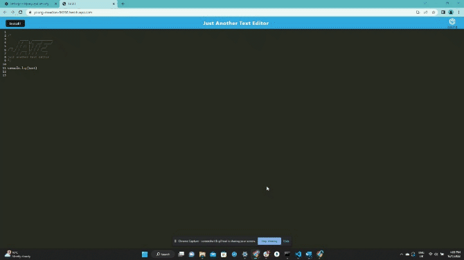

# Text Editor

* [GitHub repository](https://github.com/luizborges146/textEditor) Link to the repository<br />
* [Heroku deployment link](https://young-meadow-84288.herokuapp.com/) This is the video showing the application<br />

 [](https://opensource.org/licenses/MIT)


    
## Table of Contents
    
1.  [Description](#description)
2.  [Instalation](#instalation)
3.  [Usage Infomration](#usage)
4.  [External support documentation](#externalDoc)
5.  [Tests](#tests)
6.  [Social](#social)
7.  [Plugins](#plugins)
8.  [License](#license)
    
## [Description](#description)
The idea of this application is to be able to manipulate the data using React. With that in mind, the user can choose from Create, Read, Update and Delete the text, the application save the information in the web browser, so even if you close it accidentally, once you reopen it, it will work again.


#### [Manifest]


#### [Service Workers]


#### [Reload Page] 



## [Instalation](#instalation)
In order to use this application, you will need run the NPM INSTALL and then NPM RUN START:DEV, so it will automatically run NPM RUN BUILD and start the application for you.

    
## [Usage](#usage)
Simple to use.
 * Functionalities.
   * Text editor.
   * Can Create, Read, Update and Delete the text message.


#### Saves the information on the Session Storage, os even if the user reload the page, the information remains saved.
```
export const putDb = async (content) => {
  console.log("PUT to the database");
  const jateDb = await openDB("jate", 1);
  const tx = jateDb.transaction("jate", "readwrite");
  const store = tx.objectStore("jate");
  const request = store.put({ id: 1, value: content });
  const result = await request;
  console.log("🚀 - data saved to the database", result);
};
```


## [External support documentation](#externalDoc)
    

- [W3School](https://www.w3schools.com/)<br />
- [Mozilla](https://developer.mozilla.org)<br />
- [READ.me](https://docs.readme.com/docs/linking-to-pages")<br />
- [GitHub](https://pages.github.com/)<br />
- [React](https://reactjs.org/docs/getting-started.html)<br />
- [webpack](https://webpack.js.org/)<br />
- [npm](https://www.npmjs.com/)<br />
- [Template Literals](https://developer.mozilla.org/en-US/docs/Web/JavaScript/Reference/Template_literals)<br />


    
## [Tests](#tests)
N/A
    
## [Social](#social)
if you need any further information or support, please, send an email to: luiz.borges.146@gmail.com
    
[](https://github.com/luizborges146) [](https://www.linkedin.com/in/luiz-borges-2377b7142/)
    
    
    
## [Plugins](#plugins)
N/A
    
## [License](#license)
License Information: [MIT](https://opensource.org/licenses/MIT);

Created by Luiz Borges
Please refer to the LICENSE in the repo.

